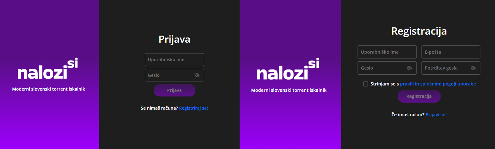
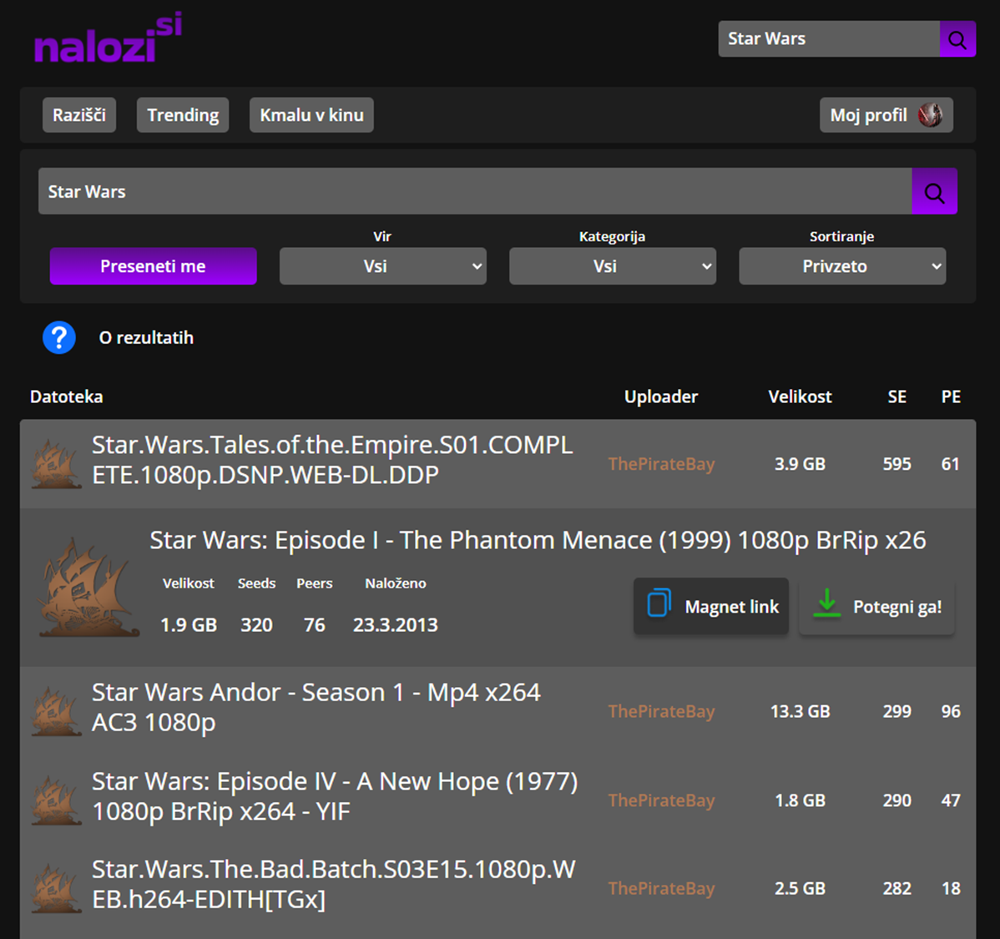
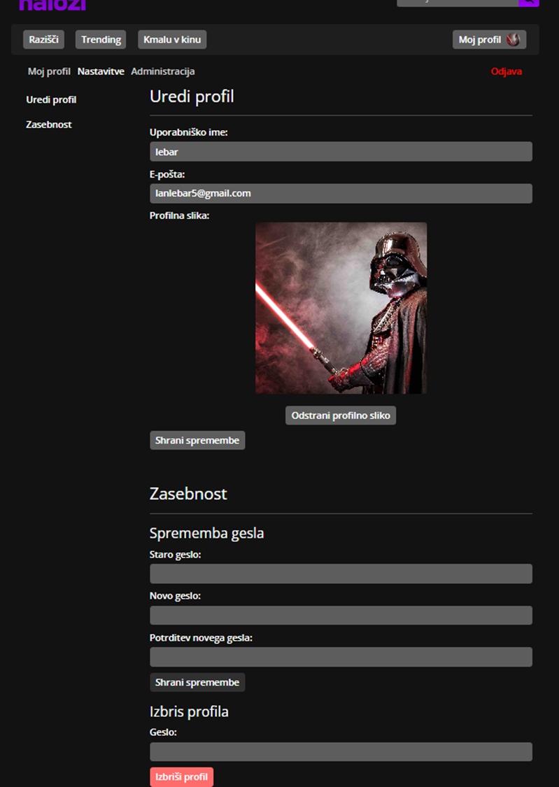

  
  

  
potegni.me is a <b>web-based torrent search platform</b>, that allows users to access content from multiple sources. Get movies, books, audio and more for free!

## Features
- Search for torrents from public torrent trackers such as [ThePirateBay](https://thepiratebay.org/), [YTS](https://yts.mx/) and more
- [COMING SOON] - native torrent tracker!
-  User registration and login
    - Modern authentication using JWT
    - Role-based access control  - regular users, admins and uploaders 
- Explore movies and series
    - I'm feeling lucky functionality, to generate ideas on what to watch
    - Movie/series of the day (set by admins then visible to other users)

Project is 100% free to use. Hosting and maintaining the project sadly isn't. If you like potrgni.me please consider [donating](https://potegni.me/donacije) to keep us alive.

Torrent searching (scraping) is provided by [torrent-search-api](https://www.npmjs.com/package/torrent-search-api). 
Recommendation data is provided by [TMDB API](https://www.themoviedb.org/).

## Gallery

  <small ><i>To be updated, project was formerly known as nalozi.si</i></small>

 

## Development
All contributions to the project are welcome! If you have a suggestion/idea/bug to report, please open an issue under one of the repositories listed below: 

### Frontend
[potegnime-angular](https://github.com/lebaaar/potegnime-angular) 
Built with Angular v20 using HTML, SCSS and TypeScript. Utilizing Bootstrap.

### Backend
[potegnime-api](https://github.com/potegnime/potegnime-api) 
Build with ASP.NET with C#. JWT authentication, PostgreSQL database with EF Core.

[potegnime-scraper](https://github.com/potegnime/potegnime-scraper) 
Search/scraper API, build it Express.js.

[potegnime-tracker](https://github.com/potegnime/potegnime-tracker) 
Torrent tracker built in C.

## License
Distributed under the GNU General Public License v3 license. See [license page](https://github.com/potegnime/potegnime-angular/blob/main/LICENSE) for more information.
