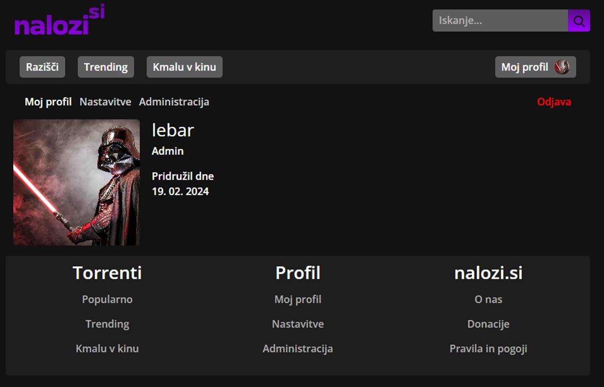

  

## Torrent search platform

Features:
-  User registration and login system
    -  Hashing passwords with BCrypt
    - Authentication using JWT
    - System of regular and users and admins
- Torrent search using [torrent-search-api](https://www.npmjs.com/package/torrent-search-api)
    - Search torrents from ThePirateBay, YTS or TorrentProject
- Explore movies and series - data provided by [TMDB API](https://www.themoviedb.org/)
    - I'm feeling lucky functionality
    - Movie/series of the day (set by admins then visible to other users)

Project is 100% free to use and contains no ads. Because of this it runs entirely on free hosting, so things might be a little slow at times:
- Frontend: hosted on [Cloudflare Pages](http://pages.cloudflare.com/)
- APIs: hosted on [Render](https://render.com/)
- Postgres: hosted on [Neon](https://neon.com/)

## Gallery

## Frontend
[potegnime-angular](https://github.com/lebaaar/potegnime-angular)

Built with Angular framework using HTML, SCSS and TypeScript. Utilizing [Bootstrap](https://getbootstrap.com/).

## Backend
[potegnime-api](https://github.com/potegnime/potegnime-api)

Build with ASP.NET for the main backend & express.js for the torrent scraper API. Using PostgreSQL database witg EF Core.

## Contributing
TODO

## License

Distributed under the MIT License. See [`LICENSE.txt`](LICENSE.txt) for more information.
